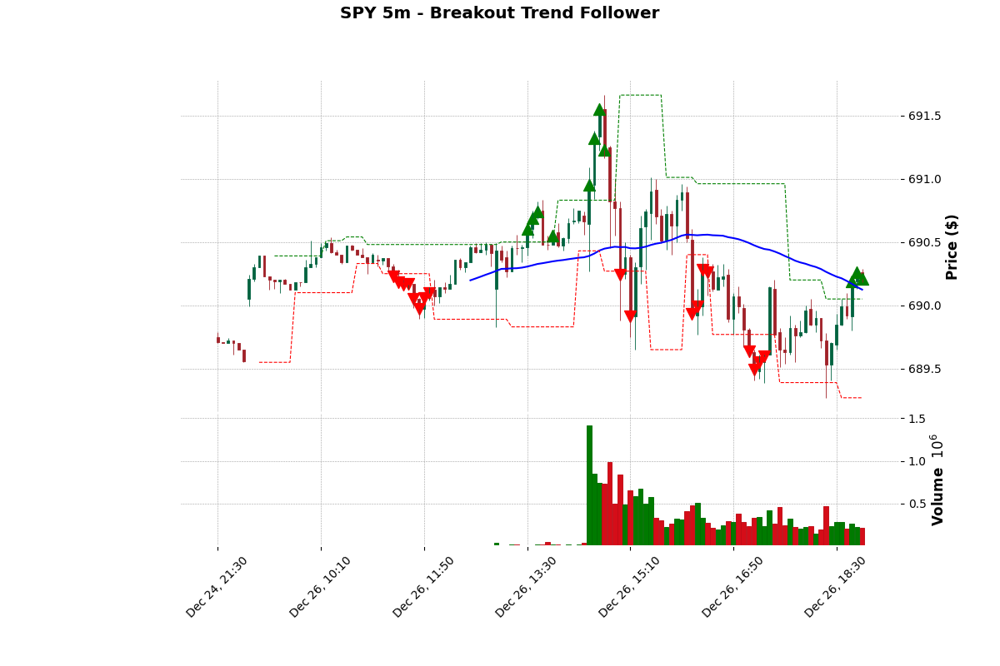

# IBKR SPY Pivot Breakout Engine

An automated market data pipeline and backtesting engine for SPY breakout strategies. This project integrates the Interactive Brokers (TWS/Gateway) API with a PostgreSQL time-series database to collect high-resolution data and execute strategy simulations.

## 🚀 Features

* **Live Data Collection**: High-resolution 1-second OHLCV data collection via `ib-insync` and Interactive Brokers.
* **Intraday Backfill**: Automated logic to retrieve missing data from previous sessions (e.g., Friday's close) using chunked 30-minute requests to respect API constraints.
* **Time-Series Storage**: Optimized PostgreSQL schema with `TIMESTAMPTZ` and indexing for fast performance on millions of rows.
* **Dynamic Resampling**: Python-based resampling engine to transform 1s tick data into 5m, 15m, or 1h candles for strategic analysis.
* **Strategy Engine**: Robust implementation of a pivot-based trend following system.
* **Dockerized Environment**: Fully containerized database and collector for one-command deployment.

## 📊 Strategy: Breakout Trend Follower

This strategy is a classic Donchian-style Trend Following system based on structural price pivots. The logic is broken down as follows:

* **Market Structure Identification**: It identifies "Pivots" (Swing Highs and Swing Lows). A pivot high is defined as a peak that is higher than the `X` number of candles before and after it.
* **Entry (The Breakout)**: You enter a long position when the price closes above the most recent Swing High. This assumes that breaking a previous resistance point signals the start of a new upward expansion.
* **The Trend Filter**: To avoid "fakeouts" during bear markets or choppy sideways action, it uses a Moving Average (SMA/EMA 50). You only take a breakout trade if the price is currently above this MA.
* **Exit (Trailing Stop)**: Instead of a fixed target, the strategy uses the most recent Swing Low as a dynamic stop loss. As the market moves higher and creates new "higher lows," the stop loss moves up automatically. You stay in the trade until a swing low is breached.


[Image of a candlestick chart showing pivot high/low points, a 50-period moving average, and highlighted trade entry/exit zones]

## 🔴 Live Execution (Paper Trading)

The project includes a `live_trader.py` script designed for real-time automated trading using the Interactive Brokers Paper Trading account.

### Workflow
1. **Warm-up**: On startup, the script retrieves the last 2 days of 5-minute candles to "warm up" the 50 SMA and Pivot indicators.
2. **Event-Driven**: The script subscribes to live 5-minute bar updates.
3. **Execution**: Logic is evaluated only at the close of each candle to prevent "ghost signals" mid-bar.
4. **Order Management**: Automatically detects existing positions via the API to prevent duplicate entries.


### Running the Live Trader
Ensure TWS or IB Gateway is running and logged into a **Paper Trading** account (indicated by a red login header).
```bash
python live_trader.py
```
## ⚠️ Risk Warning & Safety
* **Paper Trading First**: Always run this script on a paper account for at least one full week to verify execution logic before even considering a live account.

* **Slippage**: Live market orders may execute at prices slightly different from the candle close used in backtests.

* **Connectivity**: The script requires a stable internet connection. If the connection drops, ib-insync will attempt to reconnect, but market opportunities may be missed.
## 🛠 Tech Stack

* **Language**: Python 3.11
* **API**: IBKR TWS API / `ib-insync`
* **Database**: PostgreSQL 15
* **Infrastructure**: Docker & Docker Compose
* **Analysis**: Pandas, SQLAlchemy, Numpy

## ⚙️ Quick Start

### 1. Prerequisites
* Interactive Brokers TWS or Gateway installed and running.
* API enabled in TWS (Settings > API > Precautions > Uncheck "Read-Only API").
* Docker and Docker Compose installed.

### 2. Launch the Data Pipeline
```bash
docker-compose up --build
```
The collector will start backfilling Friday's data and then enter a real-time loop.


### 3. Run the Backtest
Run this on your host machine to analyze the collected data:

```bash
pip install pandas sqlalchemy psycopg2-binary
python backtest.py
```

## ⚠️ Important Notes on Pacing

This project implements strict pacing controls to adhere to IBKR's limit of 60 requests per 10 minutes for historical data.

* Real-time loop: Requests data every 15 seconds (40 requests per 10 min).

* Backfill: Uses 30-minute chunks with a 12-second delay between requests to avoid "Error 162" pacing violations.